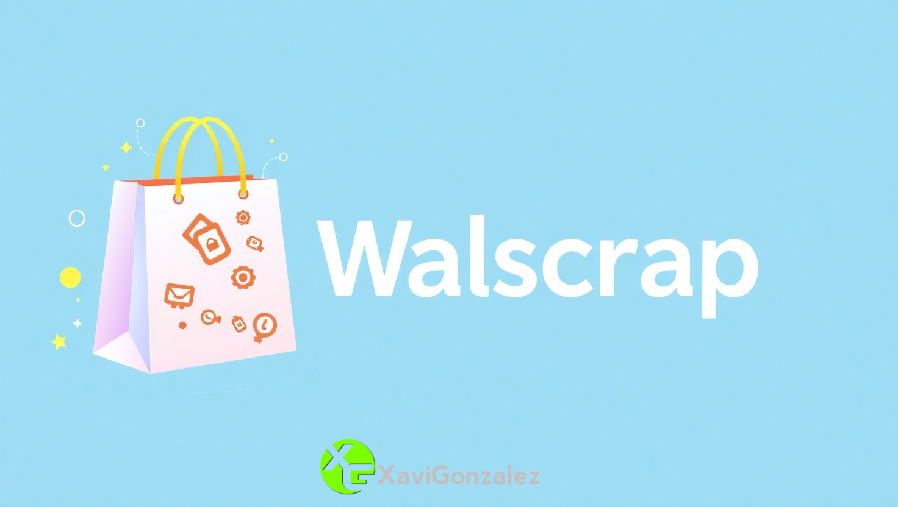

# Esto es walscrap

Walscrap es una herramienta escrita en python que realiza un barrido en tiempo de ejecución de un perfil de Wallapop, y genera una pagina web HTML con una card con los productos y un enlace a las mismas. 
Permite tener un catalogo web al estilo tienda online, gestionada directamente por Wallapop. 

# Como utilizarla

Una vez descargado el repositorio en el host que se quiera ejecutar, simplemente hay que modificar la URL del fichero scraper.py por el de un perfil concreto de Wallapop. 
Luego puedes ejecutar el script run.sh para que genere la imagen Docker usando el Dockerfile, y levante el contenedor.

# Aviso
No ofrece métodos de comunicación alternativos, simplemente muestra enlaces a los mismos productos de Wallapop.
Esta aplicación esta hecha simplemente con fines educativos, y no me hago responsable del mal uso que pudiera hacerse o si incumple alguna ley de derechos de autor o de otro tipo.

# This is walscrap
Walscrap is a tool written in Python that scans a Wallapop profile at runtime, and generates an HTML web page with a card with the products and a link to them. 
It allows you to have a web catalog in the online store style, managed directly by Wallapop. 

# Getting started
Once the repository has been downloaded to the host you want to run, you simply have to modify the URL of the scraper.py file to that of a specific Wallapop profile. 
You can then run the run.sh script to build the Docker image using the Dockerfile, and launch the container.

# Warning
It does not offer alternative communication methods, it simply shows links to the same Wallapop products.
This application is made simply for educational purposes, and I am not responsible for any misuse that may be made or if it violates any copyright or other law.

Aqui puedes ver un ejemplo de la web generada con Walscrap:

